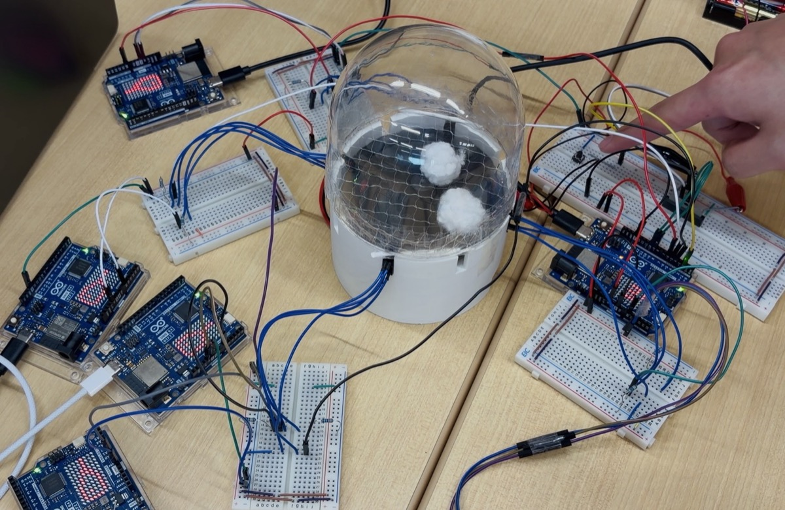
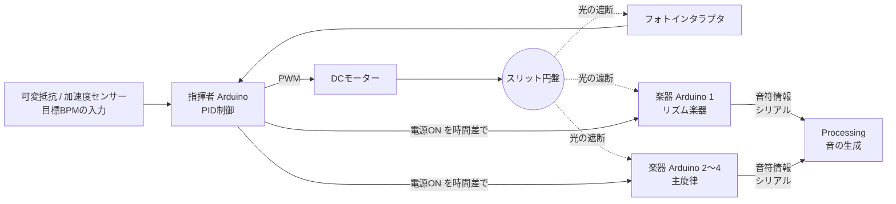
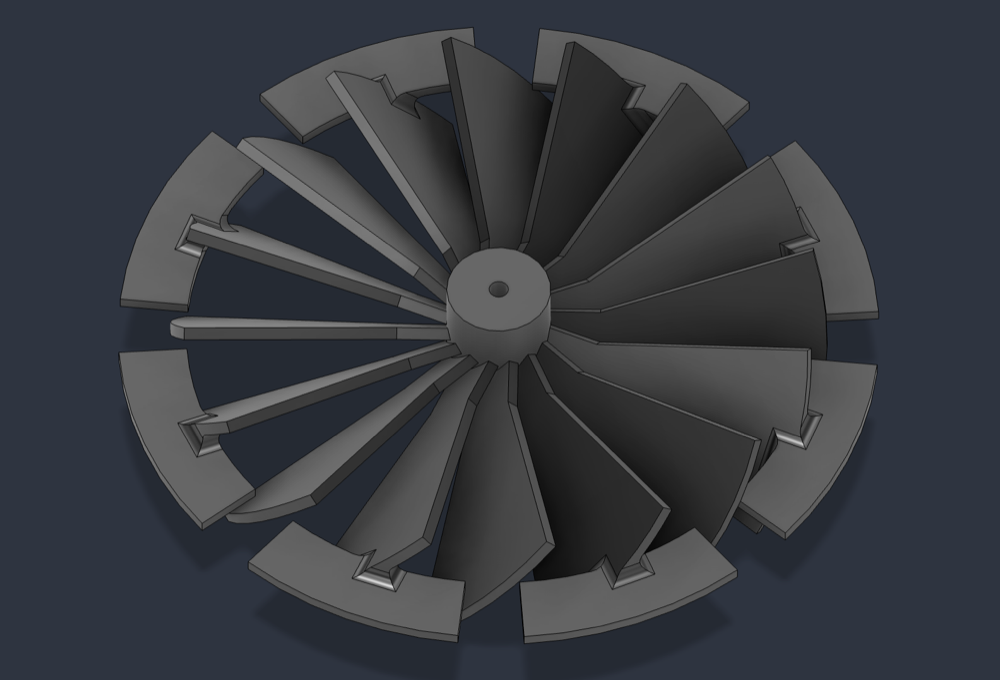
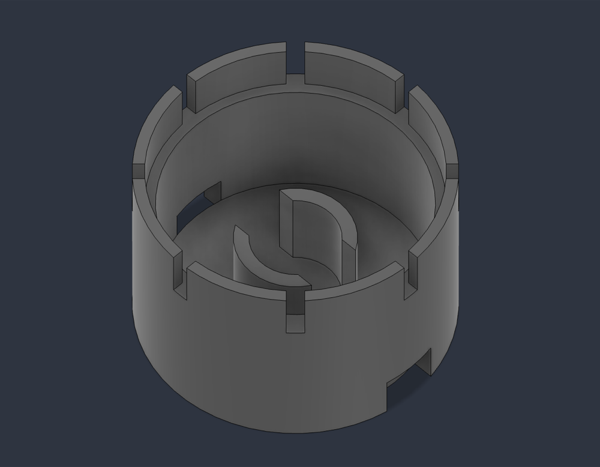
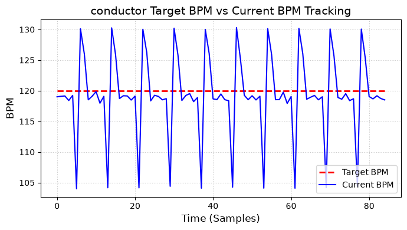

# スリット円盤で同期する Arduino オーケストラ

回転する**スリット円盤を「指揮者」**にして、複数台の Arduino 楽器を無線・有線通信なしで同期させ、「かえるの合唱」を輪唱する機械式オーケストラです。

<!-- TODO: 演奏動画をここに貼る（GitHub の編集画面に動画ファイルをドラッグ＆ドロップすると URL が挿入される） -->

中央の白い台の中でファン型のスリット円盤が回り、周りの Arduino がそのスリットを読み取ってテンポを合わせます。円盤が起こす上昇風で、透明ドームの中の綿の玉が舞う演出も付けています。

- **期間**：2026年4月〜7月（大学のハッカソン授業、6人チーム）
- **担当**：指揮者側システム（円盤の設計、センサー回路、モーター速度制御）
- **使用技術**：Arduino Uno R4 WiFi（C++）、PID制御、フォトインタラプタ、DCモーター、Fusion（3Dモデリング）、3Dプリンター、Processing

## なぜ作ったか

メディアアートでは、映像・音・照明などの複数の装置を同期させる必要があります。しかし、デジタル通信で同期すると、通信遅延や処理遅延によって装置間のタイミングがずれます。

このプロジェクトでは、**回転する円盤という物理現象そのものを共通のクロックにする**ことで、通信遅延のない同期方式を試しました。

## 仕組み

1. **指揮者**：モーターで円盤を回し、自分のフォトインタラプタでスリットの間隔を測って実際のBPMを計算します。PID制御で目標BPMに追従させます。
2. **楽器**：各 Arduino が同じ円盤のスリットを独立に読み取り、スリット45回を1拍として楽譜を進めます。
3. **輪唱**：指揮者が各楽器の電源を1小節ずつずらして入れ、輪唱を実現します。
4. **音**：楽器から送られた音符情報（音の高さ・長さ・強さ）を Processing が受け取り、音を鳴らします。

## 自分が担当したこと

チームは「指揮者側（円盤とセンシング）」「拍の検出と音符の送信」「音の生成」の3つに分かれ、自分は**指揮者側**を担当しました。

- **スリット円盤とセッティング台の設計**：Fusion で設計し、3Dプリンターで製作しました。円盤は45°間隔に8本のスリットを持ち、直径（70〜95mm）やファン形状などを変えて複数の形状を試作しました。セッティング台は、各楽器のセンサーを45°の整数倍の位置に固定します。
- **センサー回路と読み取り処理**：フォトインタラプタの値がしきい値を超えたら、50µs後にもう一度読んで確かめ、さらに1ms未満の短いパルスは無視する方式で、ノイズによる誤検出を防ぎました。
- **モーターの速度制御**：スリットの間隔から実際のBPMを計算し、PID制御で目標BPM（80〜160）に合わせました。
- **起動と停止**：静止摩擦に負けないように起動直後だけ出力を上げる処理と、逆転させてから止める「逆相ブレーキ」を実装しました。余分な拍が出ずに止まるよう、ブレーキ時間は計測して決めました。
- **輪唱の制御と表示**：楽器の電源を時間差で入れる処理と、LEDマトリクスへのBPM表示を実装しました。
- **加速度センサーでのテンポ操作**：センサーを振るとテンポが上がる（1回で+5 BPM）操作方法を実装しました。

| ファン型スリット円盤 | セッティング台 |
|---|---|
|  |  |

## 評価結果

| 項目 | 目標 | 結果 |
|---|---|---|
| 円盤の回転精度（目標BPMとの誤差率） | 1%以内 | **達成**（全デバイス） |
| 受信精度（拍の読み飛ばし） | 誤り率0.1%以下 | **達成**（672拍で読み飛ばし0件） |
| 楽器間の同期誤差 | 50ms以内 | **達成**（18.3〜24.4ms） |

同期誤差の測定では、全台のリセットピンを1つのスイッチにつないで同時にリセットし、各 Arduino の時刻の基準をそろえてから、拍の時刻を比較しました。

目標120 BPMに対する実測BPMの推移です。約105と約130の値が周期的に出ていますが、この周期は8本スリットの円盤1回転分と一致します。3Dプリントの寸法誤差でスリットの間隔がわずかに不均一なために生じる**計測上の見かけの変動**で、円盤の回転そのものが揺れているわけではありません。

## 苦労したこと・工夫したこと

### 1. 空気抵抗の大きいファン型円盤のPID制御

円盤はファン型の形状にしたため空気抵抗が大きく、回転の速さによってモーターにかかる負荷が大きく変わりました。そのため、一般的なゲインの決め方がそのままでは当てはまらず、PIDゲインの調整に多くの試行錯誤が必要でした。

シリアル通信で目標BPM・実測BPM・PWMの値を記録し、グラフで応答の変化を確かめながら、ゲインを少しずつ変えて調整しました。最終的に Kp=0.05、Ki=0.02、Kd=0 に決め、目標BPMとの誤差率1%以内を達成しました。

### 2. 回転開始の不具合

止まっている円盤を回し始めるとき、目標BPMに合わせた小さな出力では静止摩擦に負けて回らない、という問題がありました。起動直後の短い時間だけ出力を上げる「ブースト」を入れ、その出力と時間を何度も実機で試して調整することで、確実に回り始めるようにしました。

### 3. 少ない試作回数での円盤設計

3Dプリンターは友人に借りていたため、何度も印刷して試すことができませんでした。そこで、3Dプリントで起こる**材料の収縮を見込んで寸法を決める**など、印刷する前の設計段階で熟考を重ねました。3Dプリンターに詳しい友人にも何度も助言をもらい、少ない試作回数で使える円盤を完成させました。

### 4. システムの根幹を担う部分を遅れずに仕上げる

このシステムは、円盤が正しく回らないと楽器側の開発やテストを始められない構成で、自分の担当が遅れるとチーム全体が止まってしまいます。そこで、いきなり全体を作るのではなく、モーター・センサー・ブレーキをそれぞれ単体で試すプログラム（`test_motor/`、`test_sensor/`、`brake/`）を先に作り、一つずつ動作を確かめてから組み合わせました。問題が起きても原因をすぐに絞り込めるようにしたことで、指揮者側は**予定どおりに完成させ**、楽器側の開発につなげることができました。

### 5. 上級生との連携

チームは2年生と3年生の混成で、スケジュールは先輩が立てていました。一人で開発するときのように自分のペースでは進められないため、進捗があればすぐに報告し、さらに**週に1回、自分から先輩全員を集めてミーティングを開きました**。認識のずれや問題を早めに共有できたことが、予定どおりの完成につながりました。

この経験から、チームで開発するときは、自分の作業だけでなく、周りが自分の成果物を待っていることを意識して動くことが大切だと学びました。

## 今後の改善点

- **BPMの計算方法**：スリット1本ごとではなく、1回転（8本）分の時間からBPMを求めるようにすれば、スリット間隔の造形誤差の影響を受けずに済みます。
- **定常偏差の解消**：実測BPMが目標よりわずかに低い状態が続く傾向があるため、ゲインの見直しなどで改善したいと考えています。
- **コードの共通化**：センサーの読み取り、BPM計算、モーター制御の処理が各スケッチにコピーされているので、共通ライブラリにまとめます。
- **配線の整理**：ブレッドボードでの配線を、自作の基板（KiCad で設計）に置き換えます。

## ディレクトリ構成

各ディレクトリが Arduino IDE の1スケッチです。

| ディレクトリ | 内容 |
|---|---|
| `conductor/` | 指揮者の基本版。可変抵抗で目標BPMを設定する |
| `conductor_ex/` | 指揮者の本番版。輪唱制御とLEDマトリクスへのBPM表示を追加 |
| `conductor_ex_ac/` | `conductor_ex` の加速度センサー版。加速度で目標BPMを指定する |
| `instrument/` | 楽器の本番版。Processing 向けに音符情報をバイナリで送る |
| `test_instrument/` | 楽器のテキスト出力版（シリアルモニタでの確認用） |
| `brake/` | 逆相ブレーキの時間を決めるための計測用 |
| `test_motor/`, `test_sensor/`, `douki_test/`, `LED/`, `debug/` | 単体テストと調整用 |

## 動かし方

1. Arduino IDE でボード「Arduino Uno R4 WiFi」を選びます。
2. 指揮者用のボードに `conductor_ex/`、楽器用のボードに `instrument/` を書き込みます。
3. シリアル通信の速度は 115200 baud です。

### ピン配置（指揮者）

| ピン | 接続先 |
|---|---|
| A0 | フォトセンサー |
| A1 | 可変抵抗（目標BPM） |
| D9, D10 | モータードライバ |
| D2 | タクトスイッチ（停止・再始動） |
| D3〜D6 | 楽器の電源（打楽器、主旋律1〜3） |
