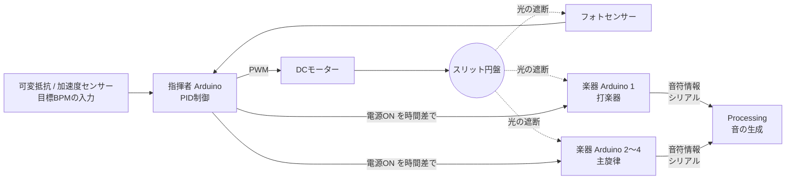

# スリット円盤で同期する Arduino オーケストラ

回転する**スリット円盤を「指揮者」**にして、複数台の Arduino 楽器を無線・有線通信なしで同期させ、「かえるの合唱」を輪唱する機械式オーケストラです。

<!-- TODO: 演奏動画（GIF か YouTube リンク）と全体写真をここに貼る -->
<!-- 例:  -->

- **期間**：2026年4月〜7月（大学のハッカソン授業、6人チーム）
- **担当**：指揮者側システム（円盤の設計、センサー回路、モーター速度制御）
- **使用技術**：Arduino Uno R4 WiFi（C++）、PID制御、フォトセンサー、DCモーター、Fusion（3Dモデリング）、3Dプリンター、Processing

## なぜ作ったか

メディアアートでは、映像・音・照明などの複数の装置を同期させる必要があります。しかし、デジタル通信で同期すると、通信遅延や処理遅延によって装置間のタイミングがずれます。

このプロジェクトでは、**回転する円盤という物理現象そのものを共通のクロックにする**ことで、通信遅延のない同期方式を試しました。

## 仕組み

1. **指揮者**：モーターで円盤を回し、自分のフォトセンサーでスリットの間隔を測って実際のBPMを計算します。PID制御で目標BPMに追従させます。
2. **楽器**：各 Arduino が同じ円盤のスリットを独立に読み取り、スリット45回を1拍として楽譜を進めます。
3. **輪唱**：指揮者が各楽器の電源を1小節ずつずらして入れ、輪唱を実現します。
4. **音**：楽器から送られた音符情報（音の高さ・長さ・強さ）を Processing が受け取り、音を鳴らします。

## 自分が担当したこと

チームは「指揮者側（円盤とセンシング）」「拍の検出と音符の送信」「音の生成」の3つに分かれ、自分は**指揮者側**を担当しました。

- **スリット円盤の設計**：Fusion で設計し、3Dプリンターで製作しました。直径（70〜95mm）やファン形状などを変えて、複数の形状を試作しました。
- **センサー回路と読み取り処理**：フォトセンサーの値がしきい値を超えたら、50µs後にもう一度読んで確かめ、さらに1ms未満の短いパルスは無視する方式で、ノイズによる誤検出を防ぎました。
- **モーターの速度制御**：スリットの間隔から実際のBPMを計算し、PID制御で目標BPM（80〜160）に合わせました。
- **起動と停止**：静止摩擦に負けないように起動直後だけ出力を上げる処理と、逆転させてから止める「逆相ブレーキ」を実装しました。余分な拍が出ずに止まるよう、ブレーキ時間は計測して決めました。
- **輪唱の制御と表示**：楽器の電源を時間差で入れる処理と、LEDマトリクスへのBPM表示を実装しました。

## 評価結果

<!-- TODO: 数値と、グラフ（目標BPMと実測BPMの時系列など）を載せる -->

| 項目 | 目標 | 結果 |
|---|---|---|
| 円盤の回転精度（目標BPMとの誤差） | 1%以内 | TODO |
| センサーの受信精度 | 99.9%以上 | TODO |
| 楽器間の同期誤差 | 50ms以内 | TODO |

## 苦労したこと・工夫したこと

<!-- TODO: 自分の言葉で2〜3個書く。例:
- モーターが低速で止まってしまう問題と、その解決方法
- PIDゲイン（Kp=0.05, Ki=0.02）をどう決めたか
- センサーのノイズで拍がずれた問題と、ダブルチェックで解決した話
-->

## 今後の改善点

<!-- TODO: 例: 各スケッチに重複しているコードを共通ライブラリにまとめる / 自作基板にする -->

## ディレクトリ構成

各ディレクトリが Arduino IDE の1スケッチです。

| ディレクトリ | 内容 |
|---|---|
| `conductor/` | 指揮者の基本版。可変抵抗で目標BPMを設定する |
| `conductor_ex/` | 指揮者の本番版。輪唱制御とLEDマトリクスへのBPM表示を追加 |
| `conductor_ex_ac/` | `conductor_ex` の加速度センサー版。加速度で目標BPMを指定する |
| `instrument/` | 楽器の本番版。Processing 向けに音符情報をバイナリで送る |
| `test_instrument/` | 楽器のテキスト出力版（シリアルモニタでの確認用） |
| `brake/` | 逆相ブレーキの時間を決めるための計測用 |
| `test_motor/`, `test_sensor/`, `douki_test/`, `LED/`, `debug/` | 単体テストと調整用 |

## 動かし方

1. Arduino IDE でボード「Arduino Uno R4 WiFi」を選びます。
2. 指揮者用のボードに `conductor_ex/`、楽器用のボードに `instrument/` を書き込みます。
3. シリアル通信の速度は 115200 baud です。

### ピン配置（指揮者）

| ピン | 接続先 |
|---|---|
| A0 | フォトセンサー |
| A1 | 可変抵抗（目標BPM） |
| D9, D10 | モータードライバ |
| D2 | タクトスイッチ（停止・再始動） |
| D3〜D6 | 楽器の電源（打楽器、主旋律1〜3） |
